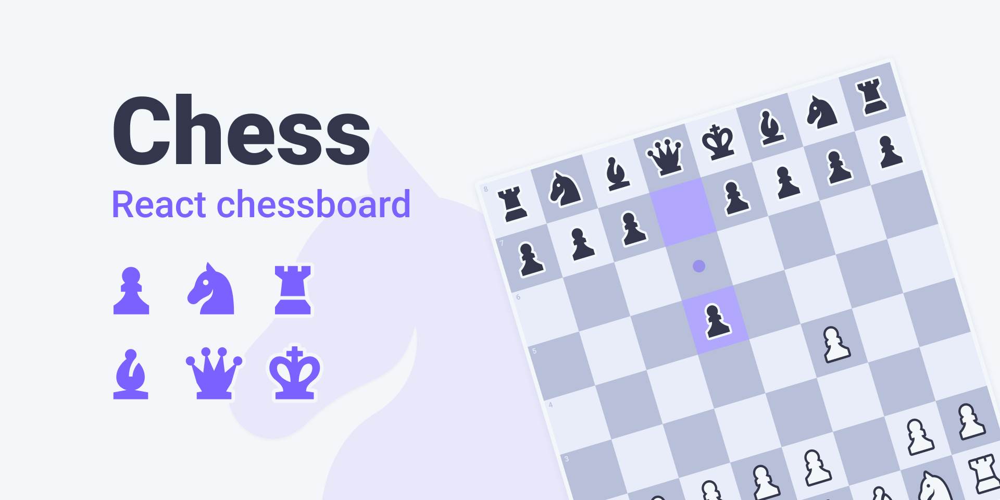

<h1 style='text-align:center' > <a href='https://react-chess-ruddy.vercel.app/' >React Chess</a> ♟ </h1>

### Two player chess game built with React js.



#### This project was bootstrapped with [Create React App](https://github.com/facebook/create-react-app).

---

### 🏃 Install And Run Locally:

1. Сlone the repository
2. Go to project folder
3. Install node_modules
4. Start development server

### 📟 Console commands:

```
git clone https://github.com/VitalyBabenko/ReactChess.git
cd ReactChess
npm install
npm start
```

---

This will run locally and listening on port 3000 (http://localhost:3000)
